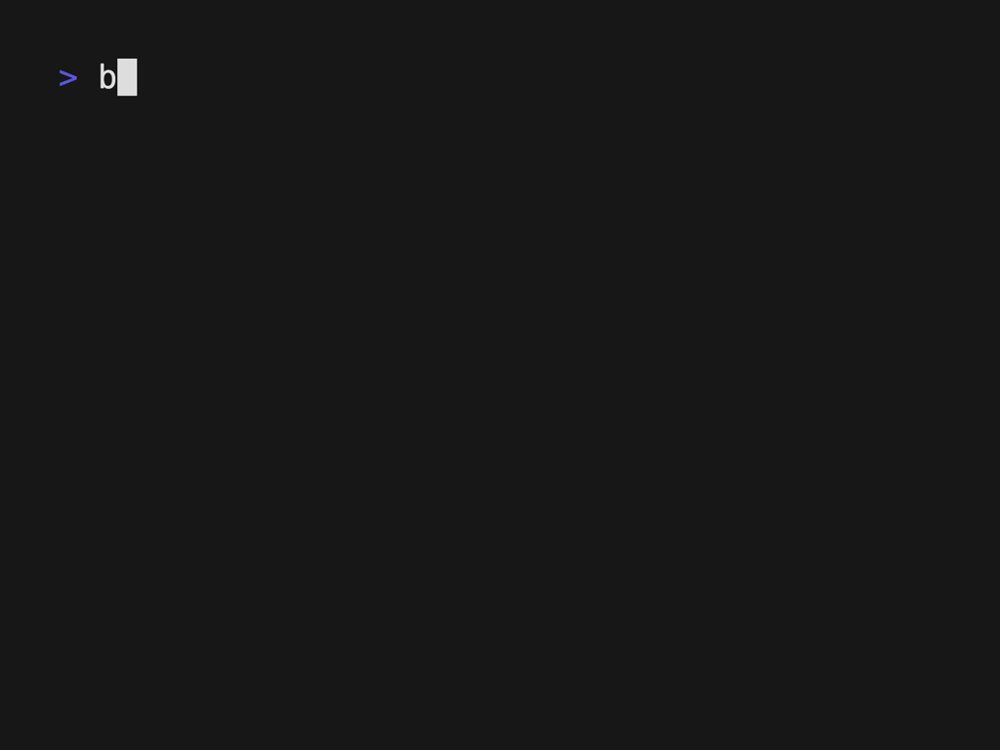

# block-cli

**block** eliminates distractions and saves you time from the command line. 



# Mission

Spend less time on the computer and more time in the sun.

# Install

> To install the program, please read the instructions below:

** important! **
- requires `go`, *you can install go here: [go.dev](https://go.dev/)*
- requires `ffmpeg` 

## Download

`git clone https://github.com/connorkuljis/block-cli.git && cd block-cli`

`make`

`make install`

## Block Sites (Guide)

1. Open your `/etc/hosts` file

`sudo vi /etc/hosts`

2. Paste an example blocklist

```
# --- social media
# 0.0.0.0 twitter.com
# 0.0.0.0 www.youtube.com
# 0.0.0.0 www.instagram.com
# 0.0.0.0 www.reddit.com
# 0.0.0.0 reddit.com
# 0.0.0.0 www.old.reddit.com
# 0.0.0.0 old.reddit.com
# 0.0.0.0 www.facebook.com
# ~ <-- lines below this character will be untouched by block-cli

```

- The program will uncomment the lines when you start the program, and add them back in when upon exit.
- If you have content you dont want the program to manipulate, add the following line to the hosts file.


Features:
- 🙆 Pomodoro-like progress bar inidicator (right in your terminal!). 
  - 🙅Automatically block/unblock any site at the IP level during the duration of the program.
    - 📬 Alerted by a system notification when a session ends.
- ⛳ Automatically record your progress.
  - 📒 Answer 'what did I get done today' by running `block history`.
- 󰑊 Capture your progress by enabling the screen recorder with `-x` or `--screen-recorder`.
  - 🎥 Compile recordings into a time-lapse.
- Cross-platform integration for `mac` and `linux` (`windows` soon).
  - If you are having issues -> [https://github.com/connorkuljis/block-cli/issues](https://github.com/connorkuljis/block-cli/issues)
- `YAML` file at `~/.config/block-cli/config.yaml`


```
❯ block start 10 'draft emails' -x
Setting a timer for 10.0 minutes.
ESC or 'q' to exit. Press any key to pause.
 100% |███████████████████████████████████████████████████████████████████████████████████████████████| (90/90, 15 it/s) [5s]
```

# Usage
```
Block saves you time by blocking websites at IP level.
Progress bar is displayed directly in the terminal.
Automatically unblock sites when the task is complete.

Usage:
  block [flags]
  block [command]

Available Commands:
  completion  Generate the autocompletion script for the specified shell
  delete      Deletes a task by given ID.
  help        Help about any command
  history     Show task history.
  reset       Reset DNS cache.
  start

Flags:
  -h, --help              help for block
  -d, --no-block          Do not block hosts file.
  -x, --screen-recorder   Enable screen recorder.
  -v, --verbose           Logs additional details.

Use "block [command] --help" for more information about a command.
```

# Troubleshooting Screen Recording with Ffmpeg
If you have `ffmpeg` on you machine you can automatically capture your screen. 

To record your screen use the `-x` flag.

If you are having issues recording your screen, follow the checklist:

- ensure system permissions are enabled to record your screen.
- run `$ ffmpeg -v` to ensure your installation is not corrupted or missing.
- a valid input device is configured in `config.yaml`
- you have restarted your application 


## Configuration

- open `.config/block-cli/config.yaml` 

Example:

```
# config.yaml
ffmpegRecordingsPath: /Volumes/WD_2TB/Screen-Recordings
avfoundationDevice: "1:0"

```


